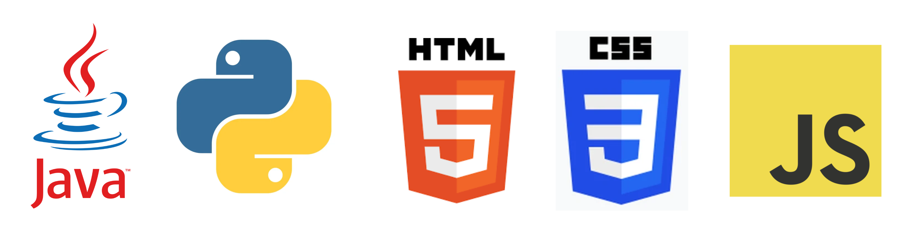
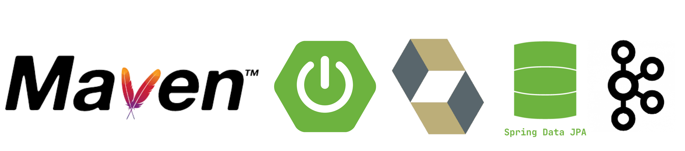

 

### Java Backend Developer • Spring Boot • Distributed Systems

  

<!-- Keep visuals tasteful: 1 row only -->

---

## About me
👋 I’m Ankita — a Java backend developer with 8+ years in the IT industry.  

- **Currently:** Building backend engineering projects on GitHub, focusing on Java and system-level concerns.
- **Previously:** Senior Data Analyst with hands-on responsibility for backend development, automation, and system optimization.

---

## How I build
- I start with **requirements + constraints**, then design
- I prefer **simple, explicit** designs over clever abstractions
- I care about **behavior under load** and edge cases
- I document decisions so the system stays understandable later

---

## Selected projects
> Each repo is treated like a mini production system: clean structure, releases, and clear scope.

### 1) Kafka-inspired Message Queue
**Focus:** partitions, consumers, offsets, throughput trade-offs  
👉 https://github.com/ankitx-sharma/kafka-inspired-demo-message-queue

### 2) Rate Limiter Service (Spring Boot)
**Focus:** sliding-window rate limiting + concurrency considerations  
👉 https://github.com/ankitx-sharma/demo_rate_limiter_service

### 3) JWT Authentication Service
**Focus:** secure auth with Spring Security + modern Java  
👉 https://github.com/ankitx-sharma/jwt_authentication_service

---

## Tech stack

  
  
    
  
  

  
<b>Tooling</b> (click to expand)

   
  

    
  

---

## Writing & knowledge sharing
I write practical posts about backend engineering and how core concepts show up in real systems:

- [Building a Rate Limiter Microservice in Java with Spring Boot](https://medium.com/@ankitx-sharma/building-a-rate-limiter-microservice-in-java-with-spring-boot-b2c129b7114d)
- [Sliding Window in Production: From LeetCode to Real-Time Analytics](https://medium.com/@ankitx-sharma/sliding-window-in-production-from-leetcode-to-real-time-analytics-a02882c34ff4)
- [Modern Java Features That Actually Change How You Code (Java 9 → 21+)](https://medium.com/@ankitx-sharma/modern-java-features-that-actually-change-how-you-code-java-9-21-5591047fbcaf)
- [Building a Secure JWT Authentication Service with Spring Boot 3 and Spring Security 6.1+](https://medium.com/@ankitx-sharma/building-a-secure-jwt-authentication-service-with-spring-boot-3-and-spring-security-6-1-564fca3a74d8)

---

## Open to
- Backend-focused collaboration
- Technical discussions / design reviews
- Code reviews and knowledge sharing
