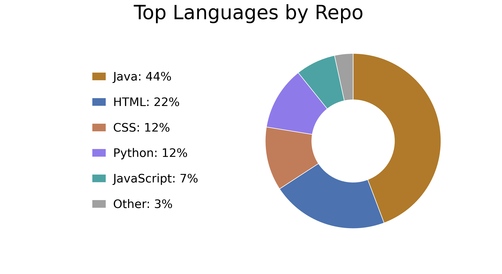

  
# 👋 Hi there, I'm Ankita
 

 

##   

---
## 🚀 About me
- 🧠 8+ years in the IT industry, with hands-on experience across multiple domains
- ☕ Java-centric development with a strong backend focus
- ⚙️ Designing structured, reliable, and maintainable systems
- 🔗 Experience with RESTful APIs, data-heavy applications, and distributed systems
- 🚀 Focus on performance, scalability, and clean service-layer design
- ✍️ Sharing knowledge through clear, practical technical writing
 
  
<!--

-->
---

  
## My Tech Stack:
   
    
   
    
   

---

## 🎯 What I’m currently focused on
- Building and refining scalable backend systems and APIs
- Deepening my understanding of system design and distributed architectures
- Actively improving how backend services perform, scale, and stay reliable
- Interested in collaborating on backend-focused and open-source projects
- Passionate about software engineering and learning designing the core systems that power great applications

---
### 🔭 Knowledge sharing and Continuous learning
- Writing technical blogs with clear, practical explanations
- Breaking down complex concepts to make learning accessible
- Exploring new tools and technologies
- Experimenting with different engineering approaches
- Continuously refining skills to stay adaptable

---

### My latest blog posts
- [Sliding Window in Production: From LeetCode to Real-Time Analytics](https://medium.com/@ankitx-sharma/sliding-window-in-production-from-leetcode-to-real-time-analytics-a02882c34ff4)
- [When Algorithms Go Live: How I Applied Two Sum in Production](https://medium.com/@ankitx-sharma/when-algorithms-go-live-how-i-applied-two-sum-in-production-4166bd451948)
- [Building a Rate Limiter Microservice in Java with Spring Boot](https://medium.com/@ankitx-sharma/building-a-rate-limiter-microservice-in-java-with-spring-boot-b2c129b7114d)
- [7 Data Structures Every Backend Developer Should Know (with Real Use Cases)](https://medium.com/@ankitx-sharma/7-data-structures-every-backend-developer-should-know-with-real-use-cases-1b75db1ac859)
- [Building a Secure JWT Authentication Service with Spring Boot 3 and Spring Security 6.1+](https://medium.com/@ankitx-sharma/building-a-secure-jwt-authentication-service-with-spring-boot-3-and-spring-security-6-1-564fca3a74d8)

<!-- ### Github Stats 

-->

<!--
**ankitx-sharma/ankitx-sharma** is a ✨ _special_ ✨ repository because its `README.md` (this file) appears on your GitHub profile.

Here are some ideas to get you started:

- 🔭 I’m currently working on ...
- 🌱 I’m currently learning ...
- 👯 I’m looking to collaborate on ...
- 🤔 I’m looking for help with ...
- 💬 Ask me about ...
- 📫 How to reach me: ...
- 😄 Pronouns: ...
- ⚡ Fun fact: ...
-->
